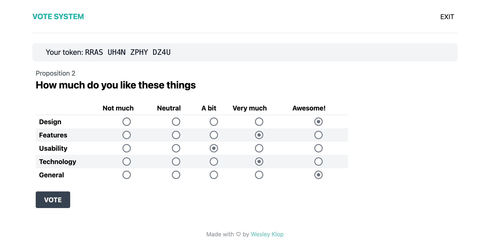
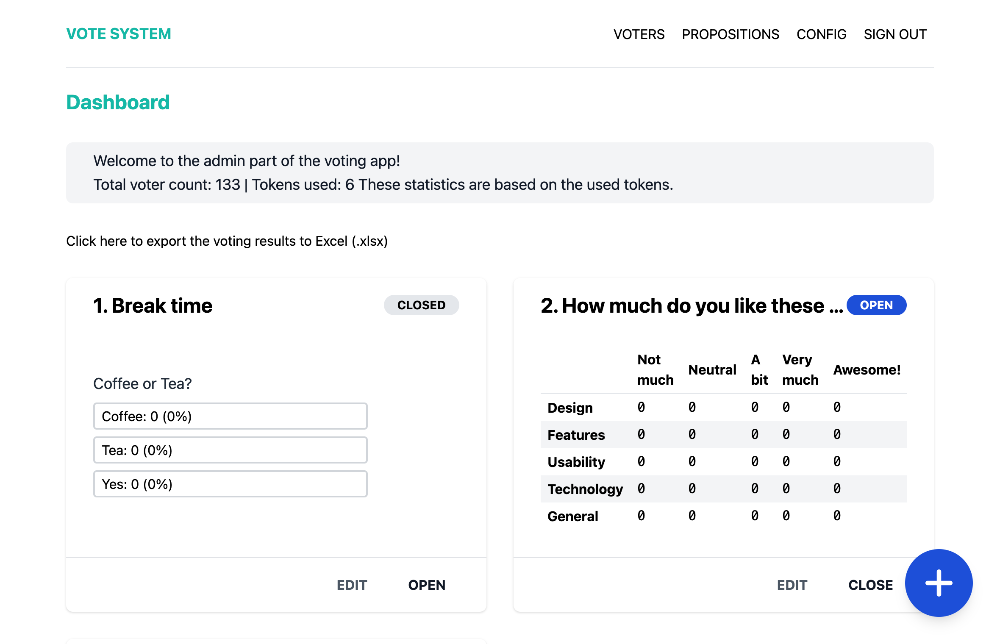

# Vote System




Vote System is a general purpose voting application that,
especially during these stay-at-home times can be useful in enabling digital voting.

## Usage / Deployment

### Deployment with docker-compose

Docker compose should **not** be used for production! Use Swarm, K8s or similar instead.

The simplest way to run the application with almost zero configuration is by using docker-compose.
Just download the [docker-compose.yml](./docker-compose.yml) and [example environment file](./.env.example),
edit the environment file, verify the docker-compose file configuration and then run the following command:

```bash
docker-compose up -d
```

This will automatically initialize a database, create an application key, run the migrations,
set up the admin user and start the application! By default, the application will be reachable via [localhost:8080]
(http://localhost:8080).

### Manual docker deployment

The easiest way to use and deploy this application is using Docker.
You can grab the latest version from this GitHub or use a certain tag by viewing the [ghcr versions page]
(https://github.com/users/WesleyKlop/packages/container/vote-system/versions).

### Prerequisites

Before you get ready to start the docker image, you should set up the following:

-   A database like Postgres or MySQL.
    -   I recommend Postgres because that is what I personally use and also what is used by the CI pipeline.
-   Copy the [.env](./.env.example) file from this repository, save it somewhere and fill in your database credentials.
    The application will automatically configure an application key if it could not be found on first run.
    You will also need to configure the websockets secret. (`PUSHER_APP_SECRET`)

### Using

You can now run the following two commands to start the websockets server and the webserver.  
You can modify the below environment variables.

```bash
ENV_FILE=/abs/path/to/your/.env-file
IMAGE=ghcr.io/wesleyklop/vote-system:main
WEB_PORT=8080 # Make sure this matches the port in APP_URL
docker run --rm -d -p 6001:6001 -v $ENV_FILE:/app/.env $IMAGE php artisan websockets:serve
docker run --rm -d -p $WEB_PORT:80 -v $ENV_FILE:/app/.env $IMAGE
```

I would recommend using the docker-compose file instead.

## Screenshots



## Contributing

Contributing guidelines can be found in [CONTRIBUTING.md](./CONTRIBUTING.md)

## Security Vulnerabilities

If you discover a security vulnerability within Vote system, please send an e-mail to Wesley Klop via [wesley19097@gmail.com](mailto:wesley19097@gmail.com). All security vulnerabilities will be promptly addressed.

## License

The Vote system is open-sourced software licensed under the [GPLv3](https://opensource.org/licenses/GPL-3.0).
